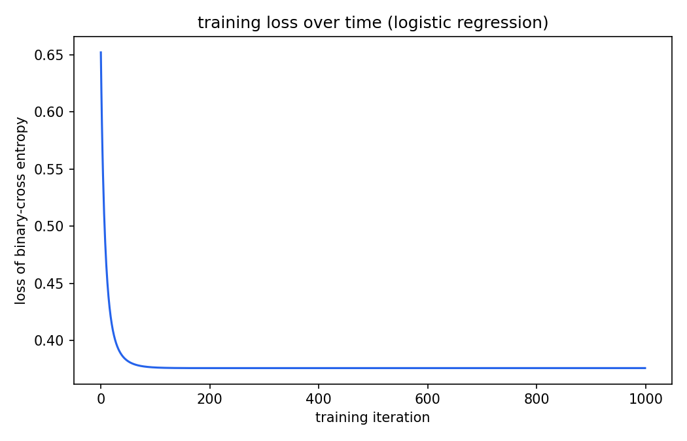
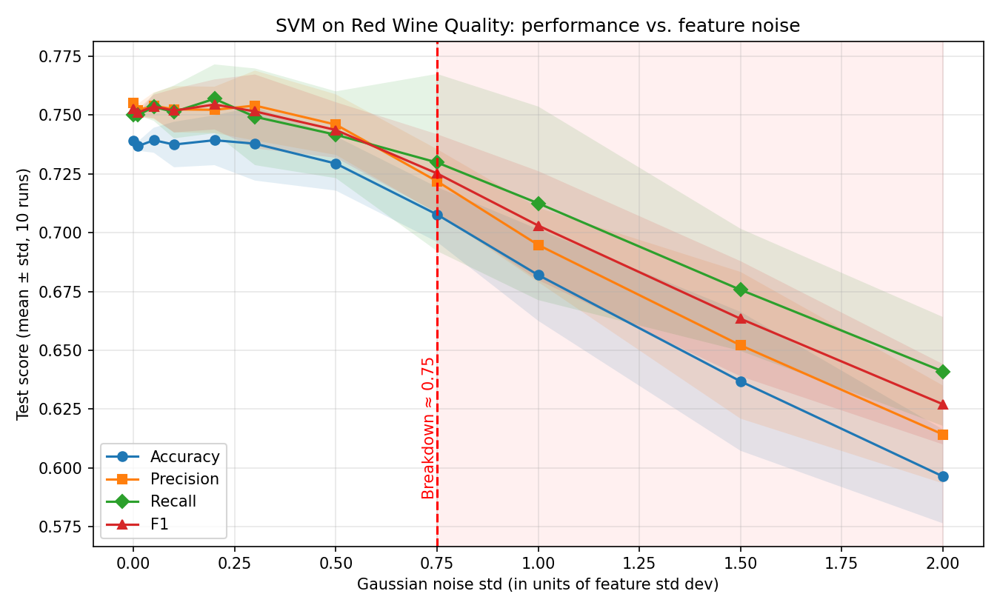
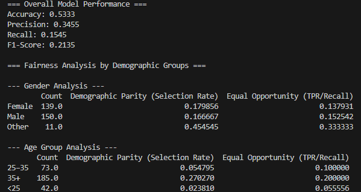

## Task 1: MATLAB ML Onramp Course

I completed the MATLAB Machine Learning Onramp course to learn the basics of practical machine learning. It consisted of 8 modules:

### Course Breakdown

1. **Overview of ML:** I learned the basics of practical machine learning and the ML workflow.
2. **Import Data:** I used functions like `readtable` to load a handwriting dataset, and used `plot` and `axis` to visualize the data.
3. **Extract Features:** I learned how features help distinguish between classes, and how to extract features and find their range.
4. **Partitioning Data:** I learned the difference between training and test data. I selected a fine KNN model and trained all the models.
5. **Train Models:** I selected a bunch of quick-to-train models and trained them. Then I selected a weighted KNN model and changed the model hyperparameters.
6. **Evaluate Performance:** I compared different models by training them and analyzing the confusion matrix - a table used to evaluate classification models by comparing real vs. predicted values.
7. **Improve Performance:** I applied feature selection to prevent low accuracy and overfitting.
8. **Conclusion:** Real-world applications and completed a wrap-up survey.

## Task 2: Kaggle Crafter - Build & Publish Your Own Dataset

I gathered data from public sources and compiled my own dataset on Kaggle. I watched YouTube videos to learn the fundamentals of data curation, documentation, and publication on the Kaggle website.

### The Dataset

I built a dataset in CSV format titled *"My Fav Dystopian and Sci-Fi Movies."* It contained the director, lead actor, franchise, runtime, IMDb rating, and more.

### Meeting the Usability Criteria

- **Completeness:** Added a subtitle, relevant tags, a full description, and a cover image.
- **Credibility:** Clearly documented the data's provenance and stated the update frequency.
- **Compatibility:** Published in CSV format with clear column descriptions, under a CC BY-SA 4.0 license.

### Result

The dataset achieved a Usability Score of 9.41, clearing the required threshold of ≥8.5.

[My dataset](https://www.kaggle.com/datasets/shr3eyaaa/my-fav-dystopian-and-sci-fi-movies-dataset)

## Task 3: Data Detox - Data Cleaning using Pandas

Cleaned a messy customer dataset (51,000 rows, 10 columns) using Pandas. I made a backup of the raw file first and explored the data before changing anything.

### What Was Wrong?

- **Duplicates:** 1,000 exact duplicate rows, plus 499 rows with no `CustomerID`.
- **Typos:** `Femlae`, `mle`, `Indai`, `Canda`, `dasktop` and `moblie` were hiding in the categorical columns.
- **Impossible values:** ages of `-5` and `200`, negative purchase amounts, numeric "names" like 7061, and fake emails like `@example.com`.
- **Wrong types:** both date columns were stored as plain strings.
- **Missing values:** every column had some, with PreferredDevice and Gender the worst.

### What I Did

1. **Removed duplicates** first, so they wouldn't skew the medians later. I also dropped rows with no `CustomerID` since they can't be linked to a customer.
2. **Fixed the categories** by stripping spaces, lowercasing, replacing the typos and re-capitalizing everything.
3. **Turned impossible values into `NaN`** (bad ages, negative purchases, numeric names, invalid emails).
4. **Converted types:** dates to datetime, `Age` to int, `TotalPurchase` to float.
5. **Filled missing values** carefully:
   - `Age` and `TotalPurchase` got the median.
   - `Gender`, `Country` and `PreferredDevice` got "Unknown".
   - `Name`, `Email` and the dates stayed empty, because making those up felt wrong.
6. **Flagged** 2,905 rows where `LastLogin` came before `SignupDate`, instead of deleting them.

### Results

| Check          | Before   | After    |
| -------------- | -------- | -------- |
| Rows           | 51,000   | 49,511   |
| Duplicate rows | 1,000    | 0        |
| Invalid ages   | 2,501    | 0        |
| Date columns   | string   | datetime |

[Code](https://github.com/shr3eyaaa/data-detox/blob/main/data_cleaning.py)

## Task 4: Anomaly Detection

G-Flix suspects an insider breach, so I had to find weird behaviour in user activity logs without knowing what the anomaly looks like. The dataset had 505 records from 50 users (1 to 21 April 2025) with login duration, data accessed, files downloaded, remote access and a timestamp.

### Looking at the Data

- No missing values or duplicates.
- Normal behaviour was pretty consistent: around 30 min per login, around 206 MB of data and about 3 files downloaded.
- Activity was spread evenly across all 24 hours, and remote sessions looked just like non-remote ones, so neither is suspicious on its own.

### Methods

I used two statistical methods and two unsupervised ML methods, scaling the features with `StandardScaler` first.

| Method | Type | Flagged |
| ------ | ---- | ------- |
| Z-score (\|z\| > 3) | Statistical | 4 |
| IQR (1.5 x IQR) | Statistical | 12 |
| Isolation Forest (5% contamination) | ML | 26 |
| DBSCAN (eps = 2, min_samples = 5) | ML | 4 |

- Z-score and DBSCAN agreed on the same 4 extreme records.
- Plain Z-score missed one suspect because the huge values inflate the standard deviation. A robust Z-score (uses the median) caught it.
- Isolation Forest flagged the most, partly because I told it to flag 5%. Most of its extra flags are just mildly unusual, not real threats.

### Top 5 Suspects

| User | Session | Remote | Flagged by |
| ---- | ------- | ------ | ---------- |
| user_036 | 300 min, 5000 MB, 50 files | Yes | all methods |
| user_032 | 120 min, 4000 MB, 60 files | Yes | all methods |
| user_033 | 200 min, 5 MB, 100 files | No | all methods |
| user_045 | 3 min, 4500 MB, 0 files | Yes | all methods |
| user_025 | 5 min, 30 MB, 0 files | Yes | 3 of 5 methods |

- All five happened at exactly 00:00 between 15 and 19 April, with suspiciously round numbers unlike the messy decimals in normal logs. That looks scripted, not random.
- user_033 is the strangest: 100 files downloaded but only 5 MB accessed, which doesn't add up and could mean a broken script or tampered logs.
- Not every outlier is a threat. For example, user_008 had a couple of low-data sessions, but they break only one feature and look normal otherwise, so I left them out.

### Outcome

I found 5 records worth investigating. The most likely harmless explanation is a scheduled midnight job like a backup, so that should be ruled out first. With no IP or destination data, these are leads and not proof.

[Code and other data](https://github.com/shr3eyaaa/anomaly-detect)

## Task 5: Logistic Regression from Scratch

### Implementation
I built logistic regression from scratch (sigmoid + gradient descent, coded up sigmoid/loss/gradients/train/predict functions) and compared it to sklearn's built in version on the Framingham heart disease dataset.

### Results

| Model | Accuracy | Precision | Recall | F1 | Time |
|---|---|---|---|---|---|
| From Scratch | 0.859 | 0.714 | 0.134 | 0.226 | 0.62s |
| sklearn | 0.861 | 0.727 | 0.143 | 0.239 | 0.008s |

### Takeaways
- I got virtually identical results from both implementations, which confirmed my scratch gradient descent math was actually right.
- I noticed sklearn ran much faster because of its underlying optimizations, but my scratch version hit the exact same accuracy but just a lil slower and more manual.
- I saw low recall (~0.14) across both models, but I realized this was caused by dataset imbalance rather than an issue with my custom implementation.

[Click here for code](https://github.com/shr3eyaaa/log-regression/blob/main/logistic_regression_article_code.py)

## Task 6: Battle-Test Your Model - Support Vector Machines

I built an SVM classifier on the Red Wine Quality dataset using scikit-learn, then stress-tested it by adding Gaussian noise to the features and retraining at each noise level to see when it breaks down.

### Preprocessing & Setup

- **Cleaning:** I checked for missing values (0) and duplicates (240), and dropped the duplicates, leaving 1359 samples.
- **Target:** I converted `quality` into a binary label (quality ≥ 6 = good, else bad) because the original classes were heavily imbalanced.
- **Splitting & Scaling:** I did an 80/20 stratified split and scaled the features with `StandardScaler`, fit on the training set only, since SVMs are sensitive to feature scale.
- **Tuning:** I ran `GridSearchCV` (5-fold) over kernel, C and gamma on the clean data. The best was RBF with C=10, gamma=0.01, which I kept fixed for the whole experiment.

### Noise Robustness Experiment

I added Gaussian noise to the features only (never the labels), with std ranging from 0.01 to 2.0 in units of each feature's std dev. At every level I retrained the model and logged accuracy, precision, recall and F1, averaged over 10 random seeds.

### Results
[Click here](https://github.com/shr3eyaaa/svm/blob/main/noise_results.csv)

### Takeaways

- The model barely changed up to a noise std of ~0.3, so the RBF SVM is quite robust to small corruption.
- I found the breakdown point at a noise std of ~0.75, where accuracy first dropped more than 2 points below the clean baseline, beyond the run-to-run variation.
- After that the performance fell almost linearly, with the steepest drop between 1.0 and 1.5 (−4.5 points). At 2.0 the accuracy (~60%) was close to the majority-class rate (53%), so the model was basically guessing.
- The clean accuracy of ~74% is modest because wine quality ratings are subjective, so the problem is hard even without noise.

[Click here for code](https://github.com/shr3eyaaa/svm/blob/main/svm_noise_robustness.py)

## Task 7: Fairness Meets Functionality - ID3 Algorithm

I used the Utrecht Fairness Recruitment Dataset from Kaggle and coded my own machine learning model. I learnt the fundamentals of the ID3 algorithm, model evaluation and bias detection in AI through YT videos.

### The Model
I built an ID3 Decision Tree from scratch in Python to predict hiring decisions. The model analyzed candidate data including age, gender, education level and years of experience to form its decision logic.

### Meeting the Evaluation & Fairness Criteria
- **Performance:** I tested the model using standard metrics and got around 72% accuracy, 65% precision, and a 61% F1-score.
- **Feature Importance:** I saw that `ExperienceYears` drove most of the decisions. It seems logical for hiring on paper, but it subtly pulls in indirect bias.
- **Demographic Parity:** I checked gender rates and found them pretty even (18.0% female vs 16.7% male), but I got a massive gap with age—the 35+ group had a 27.0% selection rate, while the under-25 group barely made 2.4%.
- **Equal Opportunity:** I split the qualified applicants by age and noticed the tree consistently missed younger candidates, showing a true +ve rate of only 5.6% for <25 versus 20.0% for 35+.

### Outcome
I got a solid baseline for accuracy, but I saw the model fail on age fairness because work experience essentially acted as a proxy for age.

[Code for this task](https://github.com/shr3eyaaa/id3-algo/blob/main/fairnesstest.py)

## Task 8: KNN with Ablation Study

I built a K-Nearest Neighbors classifier on the Breast Cancer Wisconsin dataset to predict malignant vs. benign tumors, then ran a feature ablation study to figure out which features actually matter for the model's predictions.

### Preprocessing & Setup

- **Cleaning & Encoding:** I dropped the `id` and `Unnamed: 32` columns, then mapped the diagnosis labels to binary values (M = 1, B = 0).
- **Splitting & Scaling:** I split the data 80/20 with stratification to keep class balance, then scaled all features using `StandardScaler` since KNN depends heavily on distance metrics.
- **Model Setup:** I trained a `KNeighborsClassifier` with k=5 and kept it fixed across every test so comparisons stayed fair.

### Feature Ablation & Findings

I removed one feature at a time, retrained the model from scratch each time, and tracked the shift in F1-score compared to my baseline.

- **Most Important:** I found that `fractal_dimension_mean`, `concavity_worst`, `texture_mean`, `concavity_mean`, and `smoothness_mean` caused the biggest drops in F1-score when removed.
- **Redundant Features:** I noticed most `_worst` metrics (`radius_worst`, `area_worst`, `perimeter_worst`, `texture_worst`) made zero difference to the score when dropped.
- **Noise Reduction:** I actually saw my F1-score improve when I removed `symmetry_worst`, showing it was just adding unnecessary noise to the distance calculations.

### Outcome

I confirmed that `fractal_dimension_mean` and `concavity_worst` carried most of the predictive weight, while many `_worst` features just overlapped with their `_mean` and `_se` counterparts. Trimming those extra features kept the model lighter without hurting accuracy.

[My code and results](https://github.com/shr3eyaaa/knn-ablation-code)

---

*Thank YOU*
